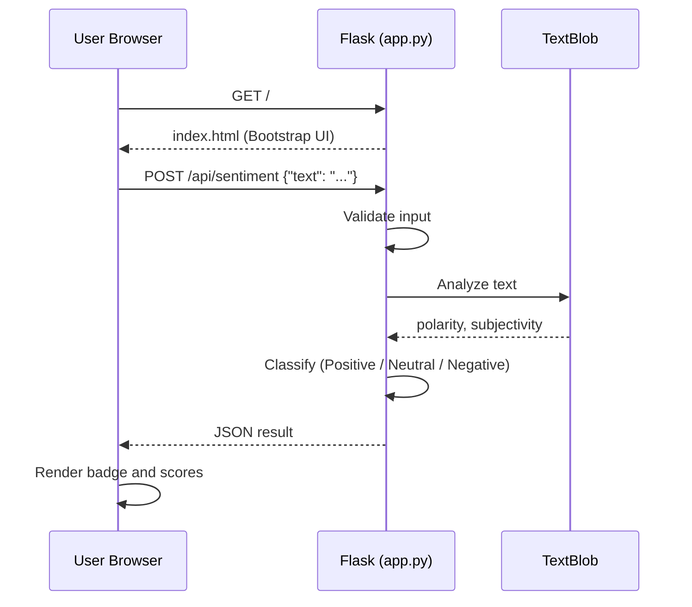

# Simple Sentiment Analyzer: Flask App on AWS ECS (EC2 Launch Type)

A Python Flask web application that analyzes the sentiment of customer feedback using **TextBlob**. Users type a review or comment into a web page and instantly get a sentiment label (Positive / Negative / Neutral) with polarity and subjectivity scores.

The app is containerized with Docker, stored in **Amazon ECR**, and deployed on **Amazon ECS using the EC2 launch type**. Source code is managed with Git and GitHub from VS Code.

This project covers the full path from code to a running container on AWS, including the real errors encountered along the way and how they were fixed.

---

## Table of Contents

1. [Features](#features)
2. [Architecture](#architecture)
3. [Tech Stack](#tech-stack)
4. [Project Structure](#project-structure)
5. [Prerequisites](#prerequisites)
6. [Run Locally](#run-locally)
7. [API Reference](#api-reference)
8. [Deployment Guide](#deployment-guide)
9. [Updating the App](#updating-the-app)
10. [Troubleshooting: Errors and Solutions](#troubleshooting-errors-and-solutions)
11. [Cost Notes](#cost-notes)
12. [Cleanup](#cleanup)
13. [Future Improvements](#future-improvements)
14. [Lessons Learned](#lessons-learned)

---

## Features

- Web UI (Bootstrap 5) for entering text and viewing results
- REST API endpoint for sentiment analysis (`POST /api/sentiment`)
- Sentiment classification with polarity (-1 to 1) and subjectivity (0 to 1) scores
- Input validation and JSON error responses
- Health check endpoint (`/health`) that also reports the app version
- Logging to stdout, ready to be collected by a container log driver
- Docker image that runs as a **non-root user** with Gunicorn (2 workers, 4 threads)
- App version configurable through the `APP_VERSION` environment variable

---

## Architecture

### Deployment flow


### Application flow



### Components

| Component | Role |
|---|---|
| **GitHub** | Stores source code and version history |
| **Docker** | Packages the app and its dependencies into an image |
| **Amazon ECR** | Private registry that stores the Docker image |
| **ECS Cluster** | Logical group that manages the container instance and tasks |
| **Task Definition** | Blueprint: image URI, CPU/memory, port mappings, network mode |
| **ECS Service** | Keeps the desired number of tasks running and handles deployments |
| **EC2 Instance** | Server that runs the container (ECS EC2 launch type) |
| **Security Group** | Virtual firewall allowing inbound HTTP (port 80) |
| **IAM Task Execution Role** | Permission for ECS to pull images from ECR and write logs |

---

## Tech Stack

- **Language / Framework:** Python 3.12, Flask 3.0.3
- **NLP:** TextBlob 0.18.0
- **Web server:** Gunicorn 22.0.0
- **Frontend:** HTML, Bootstrap 5 (CDN), vanilla JavaScript (`fetch`)
- **Containerization:** Docker
- **Version control:** Git, GitHub
- **Cloud:** AWS ECR, ECS (EC2 launch type), EC2, IAM, VPC
- **Tools:** VS Code, AWS CLI

---

## Project Structure

```
my-web-app/
├── app.py              # Flask application (routes, sentiment logic, logging)
├── templates/
│   └── index.html      # Frontend UI (rendered by Flask)
├── requirements.txt    # Python dependencies
├── Dockerfile          # Container build instructions
├── .gitignore          # Files excluded from Git (.venv, __pycache__, .env)
├── .venv/              # Local virtual environment (not committed)
└── README.md           # This file
```

> **Important:** Flask looks for HTML files in a folder named `templates/`, and the Dockerfile copies that folder into the image (`COPY templates/ templates/`). `index.html` must be inside `templates/`, not next to `app.py`.

### Endpoints

| Route | Method | Description |
|---|---|---|
| `/` | GET | Renders the web UI |
| `/api/sentiment` | POST | Analyzes text and returns sentiment metrics |
| `/health` | GET | Returns `{"status": "healthy", "version": "..."}` with HTTP 200 |

---

## Prerequisites

Install the following on your computer:

| Tool | Purpose | Check installation |
|---|---|---|
| [Git](https://git-scm.com/downloads) | Version control | `git --version` |
| [VS Code](https://code.visualstudio.com/) | Code editor | |
| [Python 3.12+](https://www.python.org/downloads/) | Run and test the app locally | `python --version` |
| [Docker Desktop](https://www.docker.com/products/docker-desktop/) | Build and run container images | `docker --version` |
| [AWS CLI v2](https://docs.aws.amazon.com/cli/latest/userguide/getting-started-install.html) | Interact with AWS from the terminal | `aws --version` |

Recommended VS Code extensions: **Python**, **Pylance**, **Docker**, **GitHub Pull Requests**, **Markdown Preview Mermaid Support** (to preview the diagrams in this README).

You also need:

- An **AWS account**
- An **IAM user** with an access key and permissions for ECR, ECS, EC2, and IAM (read) actions. Run `aws configure` and enter the access key, secret key, region, and output format
- A **GitHub account**

> Use a least-privilege IAM user rather than the root account for daily work.

---

## Run Locally

### Option 1: Python virtual environment

```bash
python -m venv .venv

# Windows PowerShell
.venv\Scripts\Activate.ps1
# Mac / Linux
source .venv/bin/activate

pip install -r requirements.txt
python app.py
```

Open http://localhost:5000.

> TextBlob's sentiment analysis works out of the box. You only need `python -m textblob.download_corpora` if you later use other TextBlob features such as noun phrase extraction.

### Option 2: Docker

```bash
docker build -t my-web-app .
docker run -p 5000:5000 my-web-app
```

Open http://localhost:5000.

---

## API Reference

### `POST /api/sentiment`

**Request**

```bash
curl -X POST http://localhost:5000/api/sentiment \
  -H "Content-Type: application/json" \
  -d '{"text": "I absolutely love this product! The service was incredible."}'
```

**Success response (200)**

```json
{
  "status": "success",
  "sentiment": "Positive",
  "badge_color": "success",
  "polarity": 0.6,
  "subjectivity": 0.8
}
```

**Classification rules**

| Polarity | Sentiment |
|---|---|
| greater than 0.1 | Positive |
| less than -0.1 | Negative |
| between -0.1 and 0.1 | Neutral |

**Error responses**

| Status | Cause | Body |
|---|---|---|
| 400 | Missing `text` field | `{"error": "Missing 'text' in request body"}` |
| 400 | Empty or whitespace-only text | `{"error": "Text cannot be empty"}` |
| 500 | Unexpected processing failure | `{"error": "Internal processing error"}` |

### `GET /health`

```bash
curl http://localhost:5000/health
# {"status":"healthy","version":"2.0.0"}
```

---

## Deployment Guide

Replace these placeholders with your own values:

| Placeholder | Example |
|---|---|
| `<ACCOUNT_ID>` | `123456789012` |
| `<REGION>` | `ap-southeast-5` |
| `<ECR_URI>` | `<ACCOUNT_ID>.dkr.ecr.<REGION>.amazonaws.com/my-web-app` |
| `<CLUSTER_NAME>` | `my-cluster` |
| `<SERVICE_NAME>` | `my-web-app-task-service-xxxx` |

### 1. Push the code to GitHub

```bash
git init
git add .
git commit -m "Initial commit"
git branch -M main
git remote add origin https://github.com/<your-username>/my-web-app.git
git push -u origin main
```

### 2. Create the ECR repository

```bash
aws ecr create-repository --repository-name my-web-app --region <REGION>
```

### 3. Authenticate Docker to ECR

```bash
aws ecr get-login-password --region <REGION> | docker login --username AWS --password-stdin <ACCOUNT_ID>.dkr.ecr.<REGION>.amazonaws.com
```

### 4. Build, tag, and push the image

```bash
docker build -t my-web-app .
docker tag my-web-app:latest <ECR_URI>:latest
docker push <ECR_URI>:latest
```

> On Apple Silicon Macs, build with `docker build --platform linux/amd64 -t my-web-app .` so the image runs on x86 EC2 instances.

### 5. Create the ECS cluster (EC2)

In the AWS Console, go to **ECS > Clusters > Create cluster**:

- Infrastructure: **Amazon EC2 instances** (untick Fargate)
- Instance type: `t3.micro` works for a demo; `t3.small` (2 GiB) is recommended because TextBlob adds memory use
- Desired capacity: min 1, max 1
- Network: public subnet, security group allowing **inbound TCP 80**

Wait until the cluster shows one registered container instance.

### 6. Create the task definition

**ECS > Task definitions > Create new task definition**:

| Setting | Value |
|---|---|
| Launch type | Amazon EC2 instances |
| Network mode | `bridge` |
| Task size | 0.25 vCPU, 0.5 GB memory (raise memory on a larger instance) |
| Container name | `web` |
| Image URI | `<ECR_URI>:latest` |
| Port mapping | Container port `5000`, Host port `80`, TCP |
| Memory hard limit | `512` MiB (see the memory note below) |
| Task execution role | `ecsTaskExecutionRole` |

> **Memory note:** the first version of this project (plain Flask) ran with a 256 MiB limit. This version imports TextBlob (which pulls in NLTK) and starts **2 Gunicorn workers**, so each worker loads its own copy. Start with `512` MiB. If the container is killed (exit code 137), either raise the limit on a `t3.small`, or reduce `--workers` to `1` in the Dockerfile.

### 7. Create the service

**Cluster > Services > Create**:

- Launch type: **EC2**
- Task definition: latest revision
- Desired tasks: `1`
- Deployment options: **Minimum running tasks 0%**, **Maximum running tasks 100%**

> With one small instance and a fixed host port 80, ECS must stop the old task before starting the new one. This causes a short downtime on each deploy.

### 8. Test

Find the EC2 instance public IPv4 address (**EC2 > Instances**) and open:

```
http://<public-ip>
http://<public-ip>/health
```

Type a sentence into the page and click **Analyze Sentiment** to confirm the API works end to end.

---

## Updating the App

After editing and saving your files:

```bash
# 1. Commit and push the source code
git add .
git commit -m "Change n-xxx"
git push

# 2. Log in to ECR (valid for 12 hours)
aws ecr get-login-password --region <REGION> | docker login --username AWS --password-stdin <ACCOUNT_ID>.dkr.ecr.<REGION>.amazonaws.com

# 3. Build, tag, push
docker build -t my-web-app .
docker tag my-web-app:latest <ECR_URI>:latest
docker push <ECR_URI>:latest

# 4. Trigger a new deployment
aws ecs update-service --cluster <CLUSTER_NAME> --service <SERVICE_NAME> --force-new-deployment --region <REGION> --no-cli-pager
```

Wait one to two minutes, then hard-refresh the browser (Ctrl+F5).

**Why step 4 is required:** ECS does not watch ECR. Pushing a new image with the same `:latest` tag does not change running tasks. A new deployment starts a new task, which pulls the latest image.

**Notes:**

- The page may update before the console marks the deployment as complete. This is normal, because the new task starts serving traffic before ECS finishes confirming stability.
- Pushing to GitHub does not update the running app. GitHub only stores the source code in this setup.
- To show a new version number on the page, set the `APP_VERSION` environment variable in the task definition (or change the default in `app.py`).

---

## Troubleshooting: Errors and Solutions

### 1. **Service deployment failed: circuit breaker triggered**

**Symptoms**

```
ECS Deployment Circuit Breaker was triggered
service ... was unable to place a task because no container instance met all of its requirements.
The closest matching container-instance has insufficient memory available.
```

**Cause:** The task (or container) requested more memory than the instance had available. A `t3.micro` has 1 GiB of RAM, and only around 900 MiB is registered with ECS. A default of 1 GB in the task definition does not fit. The default min 20% / max 200% deployment settings can also cause ECS to try to start a second task alongside the first.

**Solution**

1. Create a new task definition revision with a smaller memory size that fits the instance.
2. Update the service to use the new revision.
3. Set **minimum running tasks 0%** and **maximum running tasks 100%**.
4. Tick **Force new deployment**.
5. If it still fails, use a larger instance such as `t3.small`.

Check available memory under **Cluster > Infrastructure > Container instances > (instance) > Resources**.

---

### 2. `ERR_CONNECTION_REFUSED` when opening the public IP

**Cause:** A refused connection means traffic reached the instance but nothing was listening on port 80. This points to the port mapping, not the security group (a blocked security group makes the browser time out instead).

**Solution**

- Check the task definition port mapping: container port `5000`, host port `80`, TCP.
- Use network mode `bridge` (not `awsvpc`) for this setup.
- If the host port was left empty, ECS assigns a random high port. Fix the mapping and create a new revision.
- Confirm you are using `http://` and not `https://`.
- Confirm the public IP belongs to the instance in your cluster. It changes if the instance is stopped or replaced.

---

### 3. Page still shows old content after deployment

**Cause:** The Image URI inside the task definition did not match the repository the new image was pushed to (for example, a different region, account, or repository name). A task definition revision is fixed once created, so ECS kept pulling the old image.

**Solution**

1. Copy the correct image URI from **ECR > Repositories > Copy URI**.
2. Create a new task definition revision with that exact URI.
3. Update the service to the new revision and force a new deployment.
4. Make sure `docker tag` and `docker push` use the same URI.

**How to verify each step**

```bash
cat app.py                                           # is the edit in the file?
docker run --rm my-web-app grep -n "return" app.py   # is the edit in the image?
aws ecr describe-images --repository-name my-web-app --region <REGION> \
  --query "sort_by(imageDetails,&imagePushedAt)[-1].[imagePushedAt,imageTags]"   # was it pushed?
curl http://<public-ip>                              # real response without browser cache
```

Also compare the running task's **Created at** time with your push time.

---

### 4. `git status` shows "nothing to commit" or GitHub is unchanged

**Common causes and fixes**

- **File not saved:** a white dot on the VS Code tab means unsaved changes. Press Ctrl+S.
- **Editing a copy outside the repo:** check with `pwd` and `git rev-parse --show-toplevel`.
- **Commands chained with `&&`:** if `git commit` fails (nothing to commit), `git push` never runs. Run them separately to see the real error.
- **File ignored or flagged:** run `git check-ignore -v app.py` and `git ls-files -v` (a lowercase `h` or `S` means assume-unchanged or skip-worktree is set).
- **Wrong branch or remote:** check `git branch` and `git remote -v`.

---

### 5. VS Code: `Import "flask" could not be resolved` (or `textblob`)

**Cause:** The packages are installed inside the Docker image, but not in the Python interpreter VS Code is using locally. This does not affect Docker or ECS.

**Solution**

```bash
python -m venv .venv
source .venv/bin/activate        # Windows: .venv\Scripts\Activate.ps1
pip install -r requirements.txt
```

Then press Ctrl+Shift+P, choose **Python: Select Interpreter**, and pick the `.venv` interpreter.

---

### 6. Container fails to start on EC2 (exec format error)

**Cause:** The image was built on an ARM machine (Apple Silicon) but the EC2 instance is x86.

**Solution:** Build with `--platform linux/amd64`.

---

### 7. Long JSON output after `aws ecs update-service`

**Not an error.** The request was already sent. Press `q` or Ctrl+C to exit the pager. Add `--no-cli-pager` to suppress the output.

---

### 8. `TemplateNotFound: index.html` or the Docker build fails at `COPY templates/`

**Cause:** `index.html` is not inside a `templates/` folder. Flask's `render_template` only searches `templates/`, and the Dockerfile copies that folder explicitly.

**Solution:** Create a folder named `templates` next to `app.py` and move `index.html` into it. Rebuild the image.

---

### 9. Container is killed with exit code 137 (out of memory)

**Symptoms:** The task starts, then stops within seconds or under load. The **Stopped reason** mentions the container being killed or `OutOfMemoryError`.

**Cause:** TextBlob and NLTK increase memory use, and Gunicorn is configured with 2 workers, each holding its own copy. A container memory hard limit that is too low (for example 256 MiB) kills it.

**Solution**

- Raise the container memory hard limit (start at `512` MiB, and keep it within the task-level memory and the instance's available memory).
- Reduce workers: change `"--workers", "2"` to `"--workers", "1"` in the Dockerfile, then rebuild and redeploy.
- Move to a `t3.small` instance for more headroom.

---

### 10. The page footer says "ECS Fargate" but the app runs on EC2

**Cause:** The text in `templates/index.html` is a hard-coded label.

**Solution:** Change it to "AWS ECS (EC2)", then rebuild, push, and force a new deployment.

---

### 11. Other quick checks

| Problem | Check |
|---|---|
| Task fails to pull the image | Task execution role has ECR permissions; image URI and region are correct |
| Task keeps stopping | ECS console > Tasks > Stopped > read the **Stopped reason** |
| `Unable to locate credentials` | Run `aws configure` and confirm the IAM user's permissions |
| ECR login errors | Re-run the `get-login-password` command with the correct region |
| Task stuck in PROVISIONING | Check the container instance is registered and has free CPU/memory |
| API returns 400 | Send JSON with the `Content-Type: application/json` header and a non-empty `text` field |

---

## Cost Notes

- A `t3.micro` may be covered by the AWS Free Tier for new accounts. Check your account's eligibility. A `t3.small` is not free-tier eligible.
- ECR charges for stored image data beyond the free allowance.
- Public IPv4 addresses on EC2 incur a small hourly charge.
- Adding an **Application Load Balancer** or **NAT Gateway** adds significant monthly cost. Delete them when not in use.

Set up an **AWS Budget** alert to avoid surprise bills.

---

## Cleanup

To stop all charges:

1. Set the service's desired tasks to `0`, then delete the service.
2. Delete the ECS cluster (this also terminates the EC2 instance and Auto Scaling group).
3. Delete the ECR repository (or its images).
4. Delete unused security groups and deregister the task definition revisions.
5. Check **EC2 > Instances, Volumes, and Elastic IPs** for anything left over.

---

## Future Improvements

- [ ] **CI/CD** with GitHub Actions (build, push to ECR, and deploy on every push, authenticating with OIDC instead of access keys)
- [ ] **Infrastructure as Code** with Terraform or CloudFormation
- [ ] **Application Load Balancer** with health checks on `/health` for zero-downtime deployments
- [ ] **HTTPS and custom domain** with Route 53 and ACM
- [ ] **CloudWatch Logs** via the `awslogs` log driver (the app already logs to stdout), plus dashboards and alarms with SNS notifications
- [ ] **Auto Scaling** for ECS tasks and EC2 capacity
- [ ] **Private subnets** for instances behind the load balancer
- [ ] **Image tagging** with Git commit SHA for easy rollbacks
- [ ] **Security scanning** with ECR image scanning or Trivy
- [ ] **Unit tests** (pytest) for the API that run before deployment
- [ ] **Stronger sentiment model** (for example a transformer-based model) for better accuracy than TextBlob's rule-based approach
- [ ] **Persist results** in DynamoDB or RDS for history and analytics

---

## Lessons Learned

- ECS places tasks only where CPU and memory fit, so small instances need small task sizes, and adding libraries such as TextBlob raises the memory needed.
- A "connection refused" and a "connection timed out" point to different problems (port mapping vs. firewall).
- A task definition revision is immutable. Changing the image requires a new revision or a new deployment pointing at the updated image.
- ECS does not auto-deploy when a new image is pushed. A new deployment must be triggered.
- With a single instance and a fixed host port, rolling updates need min 0% / max 100% (and cause brief downtime). A load balancer with dynamic ports solves this.
- Running the container as a non-root user is a simple security improvement.
- Reading **service events** and **task stopped reasons** is the fastest way to diagnose ECS problems.

---

## License

This project is for learning purposes. Add a license of your choice (for example MIT) if you plan to share it publicly.
